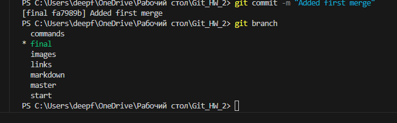
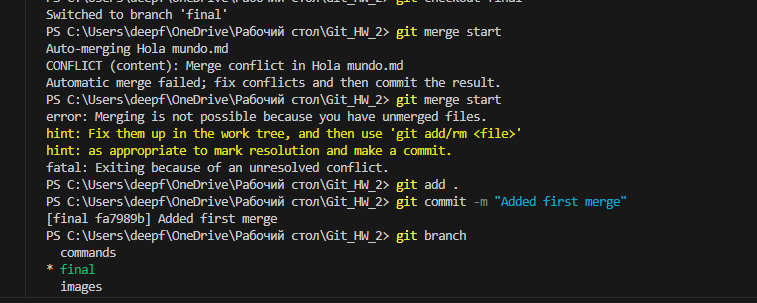
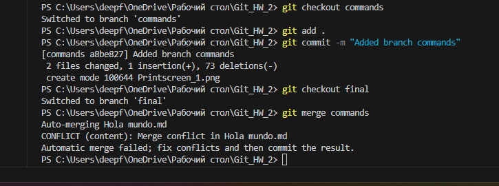
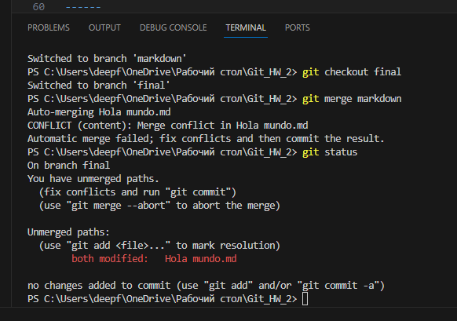
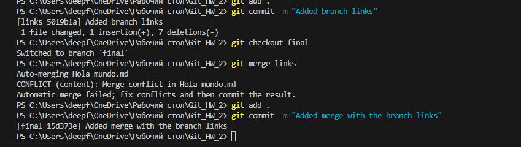
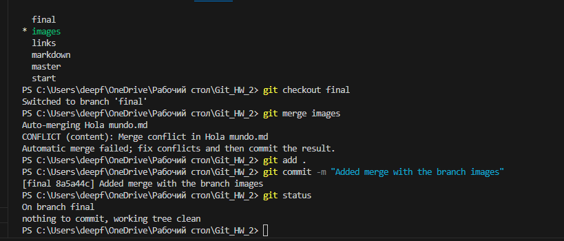

# Hola mundo!

## Начинаем знакомство с контролем версий!

**Git это самая популярная система контроля версий.**

### Чтобы создать репозиторий в ___Git___ необходимо сперва представиться в помощью следующих команд:

* git config --global user.email (adress)

* git config --global user.name "(name)"

### Чтобы **_Git_** начал работу с конкретной папкой и создал там репозиторий, необходимо ввести команду:

- git init

## Далее перечислим ряд простых команд, которые мы можем использовать при начале работы с *__Git__*:

### Базовые команды

- git status - выводит информацию о текущем статусе документа, а именно текущую ветку, есть ли несохранённые изменения.

- git version - выводит используемую версию программы ***Git***.

- git log - выводит список сохранений в хронологическом порядке.

- git log--graph - выводит список сохранений с визуализацией между ними.

### Команды для работы с ветками
- git branch - выводит информацию о созданных ветках и о том, в какой ветке находимся сейчас.

- git branch (branch name) - создаёт новую ветку и присваивает ей имя.

- git checkout (branch name) - позволяет перемещаться между ветками документа.

- git merge (branch name) -сливает указанную в команде ветку в текущую ветку.

- git branch -d (branch name) - удаляет уже слитую ветку.

### Команды для работы с версиями и их для их сохранения

- git add (file name) - добавляет новую версию файла в репозиторий.

- git commit -m "Message" - фиксирует изменения и сообщает о появлении новых версий файлов. Также добавляет сообщение с помощью флажка " -m ".

- git checkout (commit name) - позволяет перемещаться между сохранёнными версиями файла.

- git diff - показывает разницу между текущей версией файла и той, что уже была сохранена ранее.

## Теперь кратко опишем возможности языка разметки ***Markdown***

### Заголовки
Можно добавлять заголовки до шести уровней с помощью соответствующего количества символов "#" в начале строки, а также подчёркивая заголовок символами "=" для заголовка первого уровня и "-" для заголовка второго уровня.

# Первый
Первый
======
## Второй
Второй
------

### Курсив - 
Обозначается символами "*" и "_"

*Joder, que comlicado es todo este rollo!*

_Joder, que comlicado es todo este rollo!_

### Полужирный шрифт
Обозначается двойными символами "*" и "_"

**Joder, que comlicado es todo este rollo!**

__Joder, que comlicado es todo este rollo!__

### Полужирный курсив
Обозначается омбинацией символов "*" и "_"

**_Joder, que comlicado es todo este rollo!_**

__*Joder, que comlicado es todo este rollo!*__

___Joder, que comlicado es todo este rollo!___

***Joder, que comlicado es todo este rollo!***

### Зачёркнутый текст
Обозначается двойным символом "~~"

~~Joder, que comlicado es todo este rollo~~

### Нумерованный список 
Обозначается цифрами с точкой

1. Uno
2. Dos
3. Trés

### Ненумерованный список
Элементы обозначения списка могут быть разными ("+","-","*")

* Uno
- Dos
+ Trés

### Цитата 
Оформляется с помощью символа ">"

> Joder, que comlicado es todo este rollo!

## Ссылки
Оформляются следующим образом - в квадратных скобках задаём наименование ссылки, далее открываем кругляе скобки, указываем саму ссылку, далее в кавычках задаём ей некий необязательный заголовок, после чего закрываем круглые скобки.

[Статья про язык Markdown](https://ru.wikipedia.org/wiki/Markdown "Необязательный заголовок ссылки, можно написать что угодно")

## Изображение
Добавляется с помощью символа восклицательного знака, далее в квадратных скобках указывается наименование изобиращения, после чего имя файла в круглых скобках.

## Скрины для домашки

+ Созданные ветки

+ Пять слияний с конфликтами

## Работа с удалёнными репозиториями

### Основные команды

**git clone** (_ссылка_) - копирует внешний репозиторий на ПК

**git pull** - комнада позволяет скачать всё из удалённого репозитория и автоматически слить изменения с текущим репозитоирием

**git push** - отправляет текущую версию репозитория на внешний репозиторий. Требует авторизации на внешнем репозитории.

### Как сделать **_pull request_**

* Делаем **fork** репозитория (ответвление) 
* Делаем **clone** ***СВОЕЙ*** версии репозитория
* Создаём новую ветку и ***В НЕЁ*** вносим свои измененеия
* Фиксируем изменения (делаем коммиты)
* Отправляем свою версию в ***свой GitHub***
* На сайте GitHub нажимаем кнопку ***pull request***

### Как настроить совместную работу

* Создать аккаунт на GitHub.com
* Создать локальный репозиторий
* “Подружить” ваш локальный и удалённый репозитории. GitHub при создании нового репозитория подскажет, как это можно сделать
* Отправить (push) ваш локальный репозиторий в удалённый (на GitHub), при этом, возможно, 
вам нужно будет авторизоваться на удалённом репозитории
* Провести изменения “с другого компьютера”
* Выкачать (pull) актуальное состояние из удалённого репозитория

[Ссылка на тренажёр по Git][def]

[def]: https://learngitbranching.js.org/?locale=ru_RU "Ссылка на тренажёр"

